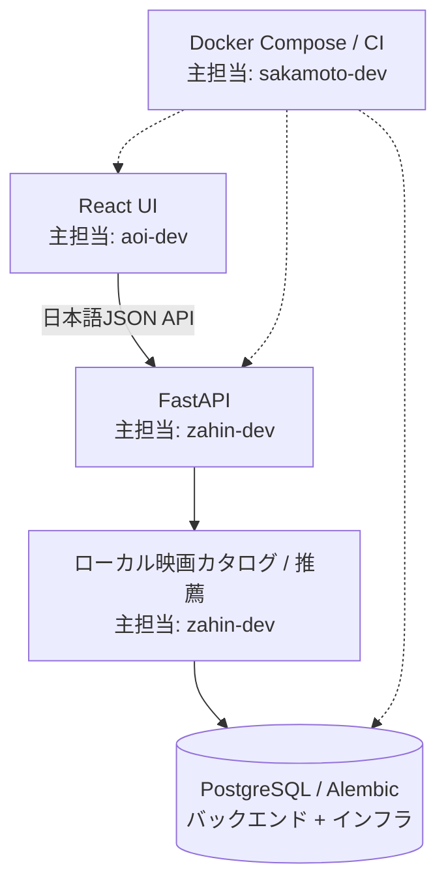

# 担当領域

## 主担当

| 領域 | GitHubユーザー | 主担当内容 |
| --- | --- | --- |
| バックエンド | `zahin-dev` | FastAPI、公開API契約、認証、SQLAlchemy/Alembic、映画カタログ境界、視聴記録、分析、推薦 |
| フロントエンド | `aoi-dev` | React、ルーティング、画面、フォーム、状態表示、アクセシビリティ、日本語UI、バックエンド接続 |
| インフラ | `sakamoto-dev` | PostgreSQL、Docker Compose、コンテナ、セルフホスト、CI/CD、環境変数、検証手順 |

## 協働方針

主担当は問い合わせ先と責任の中心を示します。次のことは意味しません。

- 特定領域を一人だけが作成したという断定
- ファイル単位の作者表示
- 排他的な所有権
- 貢献割合や順位
- 他領域への参加禁止

API契約はバックエンドとフロントエンドが共同で確認し、Docker、マイグレーション、CIへの影響はインフラ主担当を含めてレビューします。障害調査、テスト、文書化は全員が役割横断で行います。

## 構成と担当の境界

`.github/CODEOWNERS`は追加していません。対象ユーザーのリポジトリ書き込み権限をこのチェックアウトから確認できず、機能しない設定を主な担当表示手段にしないためです。
