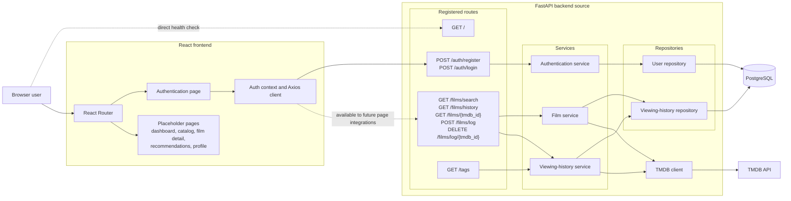
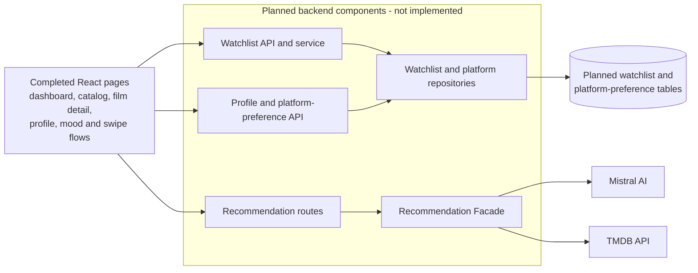

# Film-like - System Architecture

This document separates the architecture represented by the current source tree from the product's planned architecture. A component appearing in the planned section must not be interpreted as implemented.

## Current Architecture

The current source contains a React frontend, FastAPI route and service layers, SQLAlchemy repositories backed by PostgreSQL, and a TMDB client.

The authentication page is implemented. The dashboard, catalog, film-detail, recommendation, and profile routes exist in React Router but currently render placeholder components.

### Current Component Responsibilities

| Component | Current responsibility |
|---|---|
| Root route | Return a basic API health/status message |
| React authentication page | Submits registration and login requests, displays API errors, and redirects after authentication |
| Auth context and Axios client | Stores the JWT in session storage and adds it to outgoing requests |
| Auth routes and service | Register users, hash and verify passwords, and issue JWT access tokens |
| Film routes and service | Search TMDB, retrieve complete film details and watch-provider names, and report `in_history` status |
| Tag route | Return application-managed reference tags |
| Viewing-history service | Create, list, and remove history entries; resolve tags; cache title and poster URL at log time |
| User repository | Read and create users |
| Viewing-history repository | Read tags and create, query, or delete viewing-history entries |
| PostgreSQL | Store users, tags, viewing-history entries, and tag associations |
| TMDB API | Provide complete film metadata and watch-provider data |

The source follows service and repository separation: routes handle HTTP concerns, services coordinate business logic and external calls, and repositories perform database access. There is no Recommendation Facade in the current source.

> **Repository completeness note:** current route and service modules import `app.schemas`, but the package is absent from the current Git tree. The diagram reflects the checked-in route, service, repository, model, migration, frontend, and test source; it does not claim a successfully importable runtime in this checkout.

## Target Architecture - Planned, Not Current

The following diagram is a product target only. None of the watchlist, profile, platform-preference, recommendation, or Mistral components shown here exist as working backend source in the current repository.

Planned behavior includes:

- Watchlist creation, retrieval, deletion, and conversion to viewing history
- Profile management and stored streaming-platform subscriptions
- A mood questionnaire and swipe interface
- Recommendation routes backed by a Recommendation Facade
- Mistral AI calls and recommendation enrichment through TMDB
- Recommendation filtering based on stored platform subscriptions

## Author

**zahin-dev**

- University: Kanagawa Institute of Technology
- GitHub: [@zahin-dev](https://github.com/zahin-dev)
