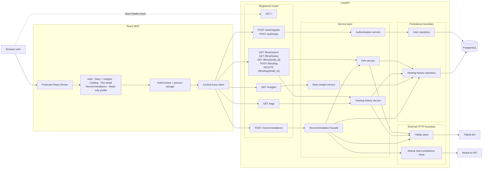

# Film-like - System Architecture

This document separates the working MVP architecture from future product ideas. Everything in **Current Architecture** has corresponding source in this repository; roadmap components are explicitly listed later.

## Current Architecture

### Current Component Responsibilities

| Component | Current responsibility |
|---|---|
| Root route | Return a basic API health/status message |
| React pages and layout | Implement authentication, protected navigation, catalog search, film details, diary management, deterministic diary insights, mood recommendations, and read-only profile display |
| AuthContext and Axios | Keep the JWT/public user snapshot in session storage, attach Bearer tokens centrally, and clear rejected sessions |
| Auth routes/service | Validate schemas, register users, hash/verify passwords, and issue JWTs |
| Film routes/service | Search TMDB, map complete details/watch providers, and report per-user history status |
| Viewing-history service | Validate a TMDB ID, persist only the ID and user reaction, retrieve/delete entries, and concurrently enrich history display metadata |
| Diary-insight route/service | Authenticate the request and deterministically aggregate only that user's selected tags, without TMDB or Mistral |
| Recommendation route | Authenticate and validate the documented mood/limit request |
| Recommendation Facade | Combine mood, tag frequencies, and recent titles; request strict Mistral output; validate/filter candidates; verify them through TMDB; retry at most once |
| Repositories | Isolate SQLAlchemy queries and mutations for users, tags, and viewing history |
| PostgreSQL | Store users, tags, TMDB IDs, reactions, and tag associations—never film metadata |
| TMDB client | Provide catalog search, film metadata, posters, credits, and watch-provider data |
| Mistral client | Call the official chat-completions endpoint with a strict JSON Schema response format |

The `backend/app/schemas` package is present and defines the Pydantic v2 contracts used by all routes and services.

## Runtime and Failure Boundaries

- TMDB is required for catalog/detail operations and for display enrichment.
- `MISTRAL_API_KEY` is optional at startup but required for live recommendations. Without it, `POST /recommendations` returns `503`.
- A failed history enrichment leaves the stored record intact and returns null title/poster fields for that item.
- Mistral candidates are untrusted until strict Pydantic parsing and TMDB resolution succeed.
- Malformed Mistral output can occur. The facade requests strict JSON Schema output, validates it with Pydantic, rejects malformed candidates, retries at most once, and exposes only controlled errors when validation or verification cannot complete. Malformed candidates therefore do not reach the UI.
- Recommendation context is rebuilt from the current mood and current stored diary tags on every request, so it changes as selected tags are added. This is dynamic request context, not online learning, fine-tuning, or automated prompt optimization.
- Tests mock TMDB and Mistral; they verify application contracts, not current external availability.
- The architecture is an MVP and does not include production concerns such as distributed rate limiting, background queues, or observability infrastructure.

## Future Roadmap - Not Current

The following remain outside the current architecture:

- watchlist models, routes, services, repositories, and UI;
- profile editing and stored streaming-platform preferences;
- social features, shared lists, payments, or subscription management;
- recommendation filtering by a user's subscribed platforms; and
- production deployment, monitoring, and scaling infrastructure.

TMDB watch-provider names in film details are informational; they are not persisted as user preferences.

## Project Attribution

Film-like is jointly owned, developed, and maintained by a three-person team.

- Repository host and public contact: [@zahin-dev](https://github.com/zahin-dev)
- Hosting under this account is for administrative convenience and does not indicate sole ownership or sole authorship.
