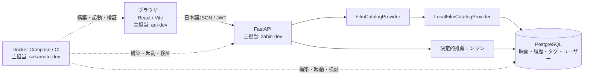

# アーキテクチャ

## 全体構成

映画検索、詳細、履歴、分析、推薦の実行中にクラウドAPIへ接続しません。

## バックエンドの層

| 層 | 責務 |
| --- | --- |
| `routes` | HTTP、認証依存、日本語の公開説明 |
| `schemas` | 入出力契約と検証 |
| `services` | 映画、履歴、分析、認証、推薦の業務ロジック |
| `catalog` | 映画プロバイダー抽象とローカル実装 |
| `repositories` | SQLAlchemyによるDBアクセス |
| `models` | ユーザー、映画、出典、タグ、視聴記録 |
| `importing` | 出典マニフェストと映画JSONの検証・投入 |

## ローカル映画プロバイダー

`FilmCatalogProvider`は検索、ローカルID取得、旧TMDB ID照合、一覧取得を定義します。既定の`LocalFilmCatalogProvider`はPostgreSQLだけを読みます。

旧クラウド映画APIアダプターは残していません。将来別のプロバイダーを追加する場合も、主要機能の既定経路とフォールバックはローカルカタログです。

## フロントエンド

- 認証画面
- 映画日記と視聴傾向
- ローカルカタログ検索
- 映画詳細と感想入力
- 気分選択と推薦
- プロフィール

日時は`ja-JP`と`Asia/Tokyo`で表示します。ポスターがない場合は日本語の代替表示を使います。

## 配信情報

配信情報は`films.streaming_platforms`、`streaming_region`、`streaming_updated_at`に保存します。地域は`JP`だけを受け入れます。外部APIからリアルタイム取得せず、更新日がある場合だけ画面へ表示します。

## セキュリティ境界

- パスワードはbcryptでハッシュ化。
- JWTは`SECRET_KEY`で署名。
- バリデーションと予期しないエラーは日本語の安全な応答へ変換。
- インポーターは外部ポスターURLと親ディレクトリ参照を拒否。
- テスト中は実ソケット接続を禁止。
- CIと設定例にクラウドAPIキーを置かない。

担当領域は[Ownership.md](../Ownership.md)を参照してください。主担当は排他的な作者を意味しません。
