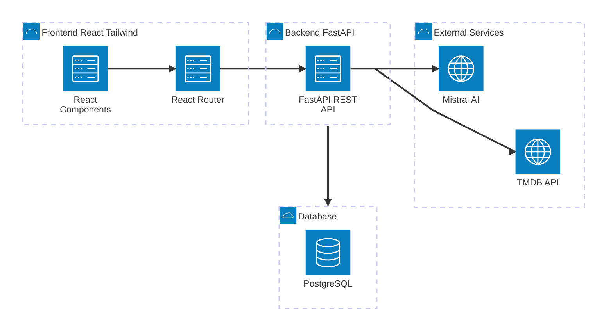
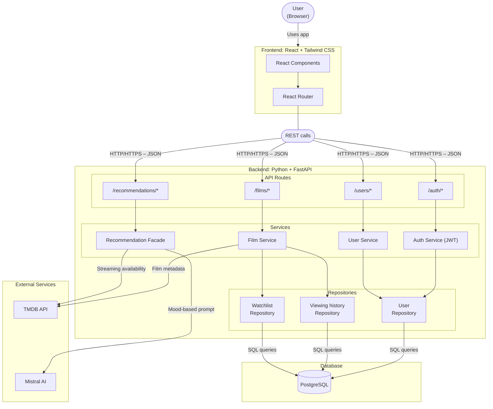

# 🎬 Film-like - System Architecture

This document contains the architecture diagrams for the Film-like application.
Two levels of detail are provided: a high-level overview and a detailed component view.

---

## Table of Contents

- [1. High-Level Architecture Overview](#high-level-architecture-overview)
  - [1.1. Component Interactions](#component-interactions)
- [2. Detailed Component Architecture](#detailed-component-architecture)
  - [2.1. Component Interactions](#component-interactions-1)
- [3. Design Patterns](#design-patterns)
- [4. Author](#author)

---

## High-Level Architecture Overview

This diagram shows the four main components of the system and how they communicate.

### Component Interactions

| From | To | Description |
|---|---|---|
| React Components | React Router | User actions trigger client-side navigation |
| React Router | FastAPI REST API | HTTP/HTTPS requests with JSON payloads |
| FastAPI REST API | PostgreSQL | SQL queries for all persistent data (users, films, watchlist, tags) |
| FastAPI REST API | TMDB API | Fetches film metadata (title, poster, synopsis, cast) and streaming availability |
| FastAPI REST API | Mistral AI | Sends mood and viewing history as a prompt, receives film recommendations in JSON |

---

## Detailed Component Architecture

This diagram zooms into the internal structure of the backend, showing the API routes, services, repositories, and their connections to the database and external services.

### Component Interactions

| From | To | Description |
|---|---|---|
| User | React Components | The user interacts with the app through the browser |
| React Components | React Router | Navigation between pages is handled client-side without full page reloads |
| React Router | API Routes | All backend communication goes through HTTP/HTTPS calls with JSON payloads |
| /auth/* | Auth Service | Handles registration, login, and JWT token generation and validation |
| /films/* | Film Service | Handles film search, logging, tagging, and watchlist management |
| /users/* | User Service | Handles user profile and streaming platform preferences |
| /recommendations/* | Recommendation Facade | Orchestrates the full recommendation flow (mood + swipe + LLM) |
| Auth Service | User Repository | Reads and writes user authentication data |
| Film Service | Viewing History Repository | Reads and writes film logging and tag data |
| Film Service | Watchlist Repository | Reads and writes watchlist entries |
| Film Service | TMDB API | Fetches film metadata (poster, synopsis, cast, genres, runtime) and streaming availability |
| Recommendation Facade | TMDB API | Fetches streaming availability for recommended films |
| Recommendation Facade | Mistral AI | Sends a structured prompt with mood and viewing history, receives film suggestions in JSON |
| All Repositories | PostgreSQL | All persistent data is stored and retrieved via SQL queries |

---

## Design Patterns

| Pattern | Where applied | Reason |
|---|---|---|
| **Repository** | Data access layer | Isolates all database queries from business logic. Each entity (User, Viewing history, Watchlist) has its own repository, making the code easier to maintain and test. |
| **Facade** | Recommendation Service | Hides the complexity of orchestrating user data and external APIs (TMDB for the films and Mistral AI for the LLM) behind a single clean interface. The route only calls one method - the facade handles everything else. |
| **REST** | API design | Standard architectural style for web APIs - stateless, resource-based, JSON responses. Consumed by the React frontend. |

---

## Author

**Félix Besançon**
Holberton School Bordeaux - Bachelor CDA, Year 1
Specialisation: Fullstack Development & Machine Learning

- GitHub: [@zahin-dev](https://github.com/zahin-dev)

---
