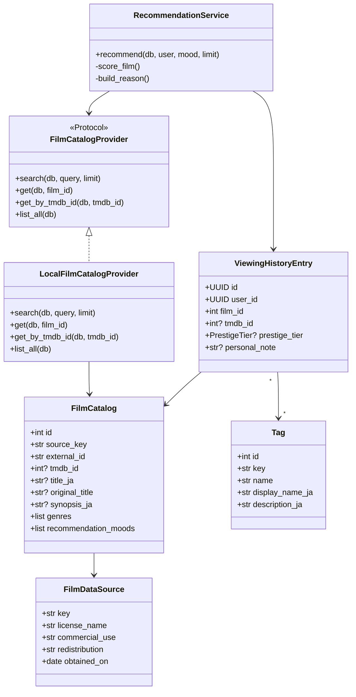

# クラス構成

## 重要な境界

- `FilmCatalogProvider`: 特定の映画APIから業務ロジックを分離。
- `FilmImportRecord`: ローカルJSONを信頼せず検証。
- `RecommendationResponse`: 気分の日本語ラベル、使用タグ、フォールバック状態を公開。
- `ViewingHistoryEntryCreate`: 新`film_id`と旧`tmdb_id`の両方を受理。
- `TagResponse`: 英語の保存値ではなく日本語表示名と説明を返す。

## チームと主担当

バックエンド境界は`zahin-dev`、React表示は`aoi-dev`、実行環境とCIは`sakamoto-dev`が主担当です。Film-likeは3名で共同開発・保守しており、この区分は単独作者や排他的な所有を示しません。3名はレビュー、デバッグ、テスト、設計、文書化を横断的に行います。`zahin-dev`アカウントでのホストは管理上の都合であり、単独所有を意味しません。
