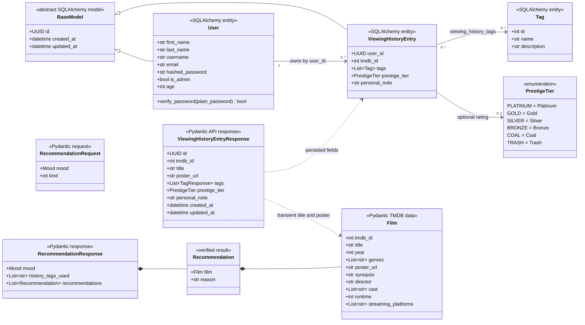

# Film-like - Class and Contract Diagram

This diagram shows the current persistent models and principal Pydantic contracts. Film metadata and recommendation candidates are API data, not local database entities.

## Current Models and Contracts

Optional values are represented compactly in Mermaid; see `backend/app/schemas` for exact nullability and validation constraints.

## Persistent Model Responsibilities

### `User`

`User` stores registration/authentication fields plus optional age and a reserved admin flag. Passwords are bcrypt hashes. Public `UserResponse` excludes `hashed_password` and `is_admin`.

### `ViewingHistoryEntry`

The entity stores only the user's relationship to a film and their reaction:

- `user_id` and `tmdb_id`;
- zero or more shared tags;
- optional prestige tier and personal note; and
- inherited UUID/timestamps.

It has no `title`, `poster_url`, synopsis, genres, credits, runtime, or provider columns. The response schema includes nullable title/poster fields because the service derives them from TMDB at response time.

### `Tag` and `PrestigeTier`

Tags are seeded shared reference data. `PrestigeTier` stores the display values `Platinum`, `Gold`, `Silver`, `Bronze`, `Coal`, and `Trash`.

## Service and Boundary Modules

| Module | Current responsibility |
|---|---|
| `auth_service` | Registration, login, password hashing, JWT creation |
| `film_service` | Map TMDB search/details/providers into `Film` contracts |
| `viewing_history_service` | Validate IDs, manage reactions, enrich history display metadata |
| `recommendation_service` | Recommendation Facade: context aggregation, strict parsing, filtering, retry, TMDB verification |
| `user_repository` | User database access |
| `viewing_history_repository` | Tag/history database access and deterministic ordering |
| `tmdb_client` | Outbound TMDB HTTP communication |
| `mistral_client` | Outbound Mistral chat-completions communication with JSON Schema mode |

The AI-only `AICandidate` and `AICandidateList` Pydantic models forbid extra fields, use strict types, constrain text, and reject empty candidate arrays. The facade additionally applies a release-year window based on the current year and deduplicates titles and resolved TMDB IDs.

## Future Concepts - Not Current Classes

`WatchlistEntry`, locally stored `Film`, `Platform`, `UserPlatform`, profile-update models, social entities, and payment/subscription models do not exist in the current source. TMDB provider data is transient.

## Author

**zahin-dev**

- University: Kanagawa Institute of Technology
- GitHub: [@zahin-dev](https://github.com/zahin-dev)
