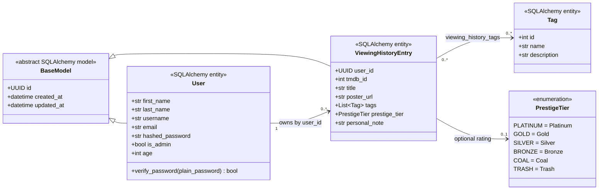

# Film-like - Class Diagram

This document describes the model classes present in the current backend source. Planned concepts are listed separately and are not shown as implemented classes.

## Current Model Classes

## Class Descriptions

### `BaseModel`

`BaseModel` is abstract and supplies `id`, `created_at`, and `updated_at` mapped columns to `User` and `ViewingHistoryEntry`. It does not define `save()` or `delete()` instance methods; persistence is handled by repository functions and SQLAlchemy sessions.

### `User`

`User` stores registration and authentication data:

| Attribute | Current behavior |
|---|---|
| `first_name`, `last_name` | Required registration fields |
| `username` | Generated as `first_name + last_name` during registration |
| `email` | Unique login identifier |
| `hashed_password` | bcrypt password hash |
| `is_admin` | Defaults to `False`; reserved for future admin behavior |
| `age` | Optional stored value; no age-based filtering currently uses it |

The only method defined on the model is `verify_password()`, which compares a supplied password with the stored bcrypt hash.

The current `User` class does not define watchlist, platform-preference, profile-update, or recommendation methods.

### `ViewingHistoryEntry`

`ViewingHistoryEntry` belongs to a user and records a film diary entry. It stores:

- the TMDB identifier
- a nullable cached title
- a nullable cached poster URL
- zero or more tags through `viewing_history_tags`
- a nullable prestige tier
- a nullable personal note

TMDB remains the source of truth for complete film metadata. Caching title and poster URL allows history lists to render without retrieving complete metadata for each item.

The model defines mapped fields and the `tags` relationship but no instance methods. Creation, queries, and deletion are implemented by `viewing_history_service` and `viewing_history_repository`.

### `Tag`

`Tag` is application-managed reference data with an integer primary key, unique name, and description. It inherits directly from the SQLAlchemy `Base`, so it does not receive UUID or timestamp fields from `BaseModel`.

### `PrestigeTier`

`PrestigeTier` is a Python enum stored through SQLAlchemy using each member's display value:

| Python member | Stored value |
|---|---|
| `PLATINUM` | `Platinum` |
| `GOLD` | `Gold` |
| `SILVER` | `Silver` |
| `BRONZE` | `Bronze` |
| `COAL` | `Coal` |
| `TRASH` | `Trash` |

## Service and Repository Structure

The current model layer is used by these source modules:

| Layer | Current modules and responsibilities |
|---|---|
| Authentication service | Registers users, hashes passwords, validates login, and creates JWTs |
| Film service | Maps TMDB search, detail, credit, and watch-provider data and checks history status |
| Viewing-history service | Resolves tags, caches title and poster URL, and coordinates history operations |
| User repository | Retrieves users by email or ID and creates users |
| Viewing-history repository | Retrieves tags and creates, lists, finds, or removes history entries |

## Planned Concepts - Not Current Classes

The following concepts appeared in earlier design documentation but have no corresponding current model, repository, and service implementation:

- `WatchlistEntry`
- `Platform` and stored user-platform relationships
- Watchlist conversion methods such as `mark_as_watched()`
- User methods for watchlists or platform preferences
- Recommendation Facade and Mistral AI client classes

The frontend also contains placeholder page components for the dashboard, catalog, film details, recommendations, and profile. Their presence in the router does not make those user-facing features complete.

## Repository Completeness Note

Film routes and services reference `Film`, `FilmWithStatus`, and viewing-history response schemas through imports from `app.schemas`. The `backend/app/schemas` package is absent from the current Git tree, so those schema definitions cannot be verified from this checkout and the backend cannot currently import successfully. They are therefore not presented as checked-in classes in the current class diagram.

## Author

**zahin-dev**

- University: Kanagawa Institute of Technology
- GitHub: [@zahin-dev](https://github.com/zahin-dev)
