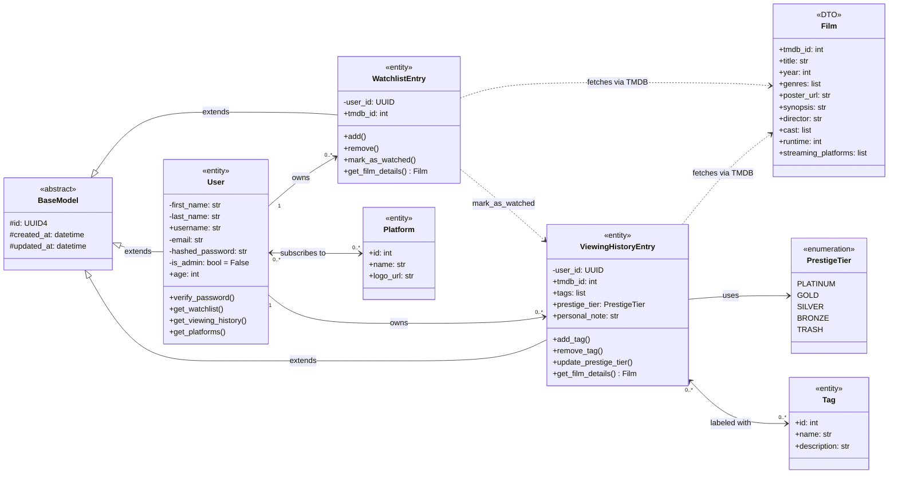

# 🎬 Film-like - Class Diagram

This document describes the class structure of the Film-like backend business logic layer.
It covers all persistent entities, data transfer objects, and enumerations used in the application.

---

## Table of Contents

- [1. Design Conventions](#design-conventions)
  - [1.1. Visibility Modifiers (UML)](#visibility-modifiers-uml)
  - [1.2. Stereotypes](#stereotypes)
- [2. Class Descriptions](#class-descriptions)
  - [2.1. BaseModel](#basemodel)
  - [2.2. User](#user)
  - [2.3. Film](#film)
  - [2.4 WatchlistEntry](#watchlistentry)
  - [2.5 ViewingHistoryEntry](#viewinghistoryentry)
  - [2.6 Tag](#tag)
  - [2.7 Platform](#platform)
  - [2.8 PrestigeTier](#prestigetier)
- [3. Class Diagram](#class-diagram)
- [4. Relationship Summary](#relationship-summary)
- [5. Design Decisions](#design-decisions)
- [6. Author](#author)

---

## Design Conventions

### Visibility Modifiers (UML)

| Symbol | Meaning | Usage in Film-like |
|---|---|---|
| `+` | Public | Methods and attributes accessible from outside the class |
| `-` | Private | Sensitive data or internal logic, not accessible from outside |
| `#` | Protected | Attributes inherited from BaseModel, accessible in subclasses only |

> *Note: Python does not enforce visibility at runtime. These modifiers reflect design intent and are used here to communicate architectural decisions clearly, as recommended by the supervising software engineer.*

### Stereotypes

| Stereotype | Meaning |
|---|---|
| `<<abstract>>` | Base class - never instantiated directly, only inherited |
| `<<entity>>` | Persistent class - stored in the PostgreSQL database |
| `<<DTO>>` | Data Transfer Object - temporary object, never stored in DB |
| `<<enumeration>>` | Fixed list of allowed values |

---

## Class Descriptions

---

### BaseModel

**`<<abstract>>`**

The base class is an `abstract` class inherited by all persistent entities (User, WatchlistEntry, ViewingHistoryEntry).
It centralises the attributes and methods that every entity needs, avoiding duplication across the codebase.

**Attributes**

| Visibility | Name | Type | Description |
|---|---|---|---|
| `#` | `id` | UUID4 | Primary key, generated automatically at creation. Never modified. |
| `#` | `created_at` | datetime | Timestamp of creation, set once and never modified. |
| `#` | `updated_at` | datetime | Timestamp of last modification, refreshed automatically by `save()`. |

**Methods**

| Visibility | Name | Return type | Description |
|---|---|---|---|
| `+` | `save()` | None | Creates or updates the entity in the database. Automatically refreshes `updated_at` on every call. |
| `+` | `delete()` | None | Permanently removes the entity from the database. PostgreSQL cascade constraints automatically remove all related records (e.g. deleting a User removes their watchlist and viewing history). |

---

### User

**`<<entity>>`**

Represents a registered user of Film-like. Handles authentication, profile data, and access to personal content (viewing history, watchlist, platform preferences).

**Attributes**

| Visibility | Name | Type | Default | Description |
|---|---|---|---|---|
| `-` | `first_name` | str | - | Stored separately from last name for flexible display and sorting. |
| `-` | `last_name` | str | - | Stored separately from first name. |
| `+` | `username` | str | - | Display name stored independently from first/last name to support privacy and future user modification (Won't Have). Generated from `first_name + last_name` at registration. |
| `-` | `email` | str | - | Unique login identifier. Validated for format and uniqueness before saving. |
| `-` | `hashed_password` | str | - | The password is never stored in plain text. It is hashed using bcrypt before storage. |
| `-` | `is_admin` | bool | False | Boolean flag. Defaults to False. Reserved for future admin features. |
| `+` | `age` | int | - | Used to store user's age and filter recommendations by age rating. Not required at registration. |
> *Note: A `preferred_language` attribute (VARCHAR, default 'en') may be added post-MVP to support language preferences.*

**Methods**

| Visibility | Name | Return type | Description |
|---|---|---|---|
| `+` | `verify_password()` | bool | Compares a plain-text input against the stored bcrypt hash. Returns True if valid. Used at login. |
| `+` | `get_watchlist()` | List[WatchlistEntry] | Queries the database and returns all WatchlistEntry records belonging to this user. |
| `+` | `get_viewing_history()` | List[ViewingHistoryEntry] | Queries the database and returns all ViewingHistoryEntry records belonging to this user. |
| `+` | `get_platforms()` | List[Platform] | Returns all Platform objects linked to this user via the user_platforms join table. |

> *Note: Input validation (name length, email format, password complexity) is handled by Pydantic schemas upstream, not by model methods. Password hashing is handled by the authentication service.*

---

### Film

**`<<DTO>>`**

A Data Transfer Object (DTO) is a temporary object used to carry data between layers of the application. It is **never saved to the database**.

Film is populated from the TMDB API response and passed to the frontend for display. It is used when displaying search results, film details, or enriching WatchlistEntry and ViewingHistoryEntry objects for display purposes.

> **Why a DTO and not a persistent entity?** Film-like uses TMDB as its single source of truth for film metadata. Storing film data locally would duplicate information that TMDB already maintains. The `tmdb_id` stored in WatchlistEntry and ViewingHistoryEntry is sufficient to retrieve full film details on demand.

**Attributes**

| Visibility | Name | Type | Description |
|---|---|---|---|
| `+` | `tmdb_id` | int | TMDB unique identifier. Used to fetch or cross-reference film data. |
| `+` | `title` | str | Film title, returned in English (en-US) for the MVP. French language support (fr-FR) is planned as a post-MVP feature. |
| `+` | `year` | int | Release year. |
| `+` | `genres` | list[str] | List of genre labels as returned by TMDB (e.g. "Drama", "Thriller"). |
| `+` | `poster_url` | str | Full URL to the film poster image hosted on TMDB's CDN. |
| `+` | `synopsis` | str | Short plot description, returned in the requested language. |
| `+` | `director` | str | Director name, extracted from the TMDB crew data. |
| `+` | `cast` | list[str] | List of main cast member names. |
| `+` | `runtime` | int | Film duration in minutes. |
| `+` | `streaming_platforms` | list[str] | List of platform names where the film is available, from TMDB Watch Providers filtered by country. |

*Film has no methods - it is a passive data container.*

---

### WatchlistEntry

**`<<entity>>`**

Represents a single film saved in a user's watchlist. A user can have zero or more WatchlistEntry records. Each entry references a film by its TMDB identifier only - no film metadata is stored locally.

**Attributes**

| Visibility | Name | Type | Description |
|---|---|---|---|
| `-` | `user_id` | UUID4 | Foreign key linking the entry to its owner. Never exposed directly to the frontend. |
| `+` | `tmdb_id` | int | TMDB identifier of the film. Used to fetch film details on demand via the Film DTO. |

**Methods**

| Visibility | Name | Return type | Description |
|---|---|---|---|
| `+` | `add()` | None | Saves the entry to the database. |
| `+` | `remove()` | None | Deletes the entry from the database. |
| `+` | `mark_as_watched()` | ViewingHistoryEntry | Creates a new ViewingHistoryEntry from this entry's `user_id` and `tmdb_id`, then deletes this WatchlistEntry. Triggered when the user marks a watchlisted film as seen. |
| `+` | `get_film_details()` | Film | Calls the TMDB API with `tmdb_id` and returns a fully populated Film DTO. |

---

### ViewingHistoryEntry

**`<<entity>>`**

Represents a single film that a user has watched and rated. This is the core entity of Film-like - it stores the user's personal experience of a film through tags, a prestige tier, and an optional personal note.

> *Note: the creation date of this entry (inherited as `created_at` from BaseModel) is used as the watch date. No separate `watched_at` field is needed.*

**Attributes**

| Visibility | Name | Type | Description |
|---|---|---|---|
| `-` | `user_id` | UUID4 | Foreign key linking the entry to its owner. Never exposed directly to the frontend. |
| `+` | `tmdb_id` | int | TMDB identifier of the film. Used to fetch film details on demand via the Film DTO. |
| `+` | `tags` | list[Tag] | List of Tag objects associated with this entry. Managed via a join table (`viewing_history_tags`). |
| `+` | `prestige_tier` | PrestigeTier | A PrestigeTier enum value representing the user's global rating of the film. Optional - can be left unset. |
| `+` | `personal_note` | str | Optional free-text field for the user's personal review or impressions. |

**Methods**

| Visibility | Name | Return type | Description |
|---|---|---|---|
| `+` | `add_tag()` | None | Adds a Tag to this entry by inserting a row in the `viewing_history_tags` join table. |
| `+` | `remove_tag()` | None | Removes a Tag from this entry by deleting the corresponding row in the join table. |
| `+` | `update_prestige_tier()` | None | Updates the `prestige_tier` field and calls `save()` to persist the change and refresh `updated_at`. |
| `+` | `get_film_details()` | Film | Calls the TMDB API with `tmdb_id` and returns a fully populated Film DTO. |

---

### Tag

**`<<entity>>`**

Represents a predefined emotional or contextual label that a user can apply to a film they have watched. Tags are fixed and managed by the application - users cannot create custom tags in the MVP.

Tags are shared across all users. Each tag appears once in the `tags` table and is referenced by many ViewingHistoryEntry records through a join table (`viewing_history_tags`).

**Attributes**

| Visibility | Name | Type | Description |
|---|---|---|---|
| `+` | `id` | int | Integer primary key, auto-incremented by PostgreSQL. Used as a foreign key in the join table. |
| `+` | `name` | str | Tag label displayed to the user (e.g. "Guilty pleasure", "Great with a group"). |
| `+` | `description` | str | Short explanation of when to use this tag, displayed as a tooltip or helper text in the UI. |

*Tag has no methods - its records are managed directly by the application at initialisation.*

> **Examples:** "Great with a group", "Guilty pleasure", "Needs full attention", "Mind blowing", "Would rewatch immediately", "Perfect background watch", "Emotional wreck", "So stupid it's good".

---

### Platform

**`<<entity>>`**

Represents a streaming platform available to users. The list of platforms is fixed and managed by the application. Users select which platforms they subscribe to in their profile, and this selection is used to filter recommendations.

**Attributes**

| Visibility | Name | Type | Description |
|---|---|---|---|
| `+` | `id` | int | Integer primary key, auto-incremented by PostgreSQL. Used as a foreign key in the join table. |
| `+` | `name` | str | Platform name displayed in the UI (e.g. "Netflix", "Prime Video"). |
| `+` | `logo_url` | str | URL to the platform logo image, displayed alongside the platform name in the UI. |

*Platform has no methods - its records are managed directly by the application at initialisation.*

> **Examples:** Netflix, Prime Video, Disney+, Canal+, Apple TV+, OCS.

> **Why an integer ID instead of UUID?** Tag and Platform are reference tables managed by the application, not by users. Their IDs are never exposed in security-sensitive contexts. An auto-incremented integer is simpler, lighter, and faster for join operations than a UUID.

---

### PrestigeTier

**`<<enumeration>>`**

A fixed set of values representing the user's global rating of a film. Using an enumeration ensures consistency - no typos, no case mismatches - and the allowed values are self-documenting in the schema.

| Value | Intended meaning |
|---|---|
| `PLATINUM` | An absolute favourite - a personal masterpiece |
| `GOLD` | Excellent - highly recommended |
| `SILVER` | Good - worth watching |
| `BRONZE` | Average - watchable but unremarkable |
| `TRASH` | Poor - would not recommend |

---

## Class Diagram

---

## Relationship Summary

| Relationship | Type | Description |
|---|---|---|
| BaseModel → User / WatchlistEntry / ViewingHistoryEntry | Inheritance | Shared attributes (`id`, `created_at`, `updated_at`) and CRUD methods (`save`, `delete`) |
| User → WatchlistEntry | One-to-many | A user owns zero or more watchlist entries |
| User → ViewingHistoryEntry | One-to-many | A user owns zero or more viewing history entries |
| User ↔ Platform | Many-to-many | A user subscribes to multiple platforms; each platform can have many users. Managed via `user_platforms` join table. |
| ViewingHistoryEntry ↔ Tag | Many-to-many | An entry can have multiple tags; each tag can be used across many entries. Managed via `viewing_history_tags` join table. |
| ViewingHistoryEntry → PrestigeTier | Association | Each entry optionally uses one value from the PrestigeTier enumeration |
| WatchlistEntry → Film | Dependency (DTO) | Fetches film data from TMDB on demand - not a database relationship |
| ViewingHistoryEntry → Film | Dependency (DTO) | Fetches film data from TMDB on demand - not a database relationship |
| WatchlistEntry → ViewingHistoryEntry | Dependency | `mark_as_watched()` creates a ViewingHistoryEntry and deletes the WatchlistEntry |

---

## Design Decisions

**Why no Film table in the database?**
Film-like uses TMDB as its single source of truth for film metadata. Storing film data locally would duplicate information that TMDB already maintains, adding complexity without benefit for the MVP. The `tmdb_id` stored in each entry is sufficient to retrieve full film details on demand. A local film cache may be considered post-MVP to support collaborative filtering features.

**Why is `username` stored as a column rather than computed from `first_name + last_name`?**
`username` is stored as an independent field to support user privacy and a future modification feature (Won't Have user story). A user may want a display name that differs from their real name, and must be able to change it without affecting authentication data (`first_name`, `last_name`, `email`). Generated from `first_name + last_name` at registration, it can be updated independently afterwards.

**Why do `Tag` and `Platform` not inherit from `BaseModel`?**
`BaseModel` is designed for user-owned entities: it provides a UUID primary key, `created_at` and `updated_at` timestamps. `Tag` and `Platform` are application-managed reference tables - their records are seeded at initialisation and never created, modified, or deleted by users at runtime.
They therefore have no need for UUIDs (predictable integer IDs are simpler and faster for join operations), no need for audit timestamps, and no need for instance-level persistence methods.
Inheriting from `BaseModel` would add unnecessary complexity and misrepresent their nature in the schema.

**Why integer IDs for Tag and Platform?**
Tag and Platform are reference tables managed by the application, not by users. Their IDs are never exposed in security-sensitive contexts. An auto-incremented integer is simpler, lighter, and faster for join operations than a UUID.

**Why a fixed Tag list?**
Fixed tags ensure consistency across all users and enable future analytics (most-used tags, tag-based recommendations). Custom user-defined tags are planned as a post-MVP feature.

**Why an enumeration for PrestigeTier?**
An enumeration prevents inconsistent values (typos, case mismatches) and makes the allowed values self-documenting in the schema. It also enables direct comparison and sorting in the database.

**Why is watched_at absent from ViewingHistoryEntry?**
The creation date of a ViewingHistoryEntry is semantically equivalent to the date the film was watched. The `created_at` field inherited from BaseModel serves this purpose without duplication.

**Why is there an `age` attribute in the `User` class?**
Since incorporating the user's age into the recommendation process is not part of the MVP (US-14 is in status 'Could Have'), the `age` attribute of the `User` class is optional. To simplify implementation and limit the collection of personal data, we use the age directly rather than the date of birth; this may be subject to future changes.

**Why is `age` a public attribute when other personal data is private?**
Unlike `first_name`, `last_name`, `email`, and `hashed_password` - which are authentication or identity data that must never be exposed - `age` is used directly by the Recommendation Facade when building the prompt sent to the LLM.
Making it public reflects this role as an input to the recommendation pipeline rather than a sensitive credential. It remains optional (no age rating filter is applied if unset), in line with US-14 (Could Have).

---

## Author

**Félix Besançon**
Holberton School Bordeaux - Bachelor CDA, Year 1
Specialisation: Fullstack Development & Machine Learning

- GitHub: [@zahin-dev](https://github.com/zahin-dev)

---
