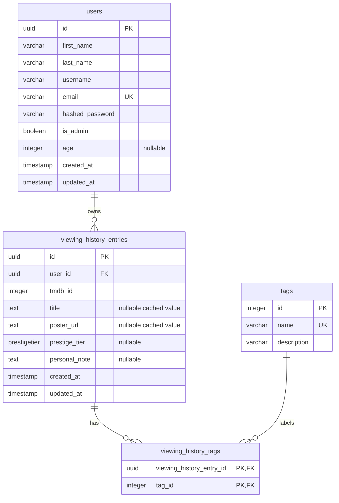

# Film-like - Entity Relationship Diagram

This document shows only the database objects created by the current SQLAlchemy models and Alembic migrations. It does not include planned watchlist, platform, or user-platform-preference tables.

TMDB is used as the source of truth for complete film metadata. The application stores the TMDB identifier and caches the film title and poster URL in viewing-history entries so that history lists can be displayed without an additional TMDB request for every item.

## Current Database Schema

## Tables

### `users`

Stores registration and authentication data plus optional age and reserved admin status. Email uniqueness is enforced by the database. Passwords are stored as bcrypt hashes, not plain text.

### `viewing_history_entries`

Each entry belongs to a user and stores:

- `tmdb_id`, which identifies the film in TMDB
- cached `title` and `poster_url` values captured when the film is logged
- an optional `prestige_tier`
- an optional `personal_note`
- creation and update timestamps

Complete details such as synopsis, genres, credits, runtime, and current watch-provider data remain sourced from TMDB. The cached title and poster URL are deliberately local so a history list does not require one TMDB request per entry.

### `tags`

Stores the application-managed tag catalogue. Tags use integer primary keys and are seeded by `backend/seeds/seed_tag.py`.

### `viewing_history_tags`

Associates viewing-history entries with zero or more tags. Its two foreign-key columns form a composite primary key, preventing the same tag from being linked to the same entry twice.

## Relationship Summary

| Relationship | Type | Storage |
|---|---|---|
| User to viewing-history entry | One-to-many | `viewing_history_entries.user_id` references `users.id` |
| Viewing-history entry to tag | Many-to-many | `viewing_history_tags` joins `viewing_history_entries` and `tags` |

## Prestige Tier Values

The PostgreSQL `prestigetier` enum and Python `PrestigeTier` enum contain these stored values:

| Stored value | Intended meaning in source comments |
|---|---|
| `Platinum` | Exceptional; an all-time favourite |
| `Gold` | Great and memorable |
| `Silver` | Good and worth watching |
| `Bronze` | Decent; had its moments |
| `Coal` | Poor and mostly disappointing |
| `Trash` | Bad; regretted watching it |

## Scope Boundaries

The current schema has no local `films` table. It also has no `watchlist_entries`, `platforms`, or `user_platforms` table. Those concepts are planned and must not be treated as current database entities.

The current source also has no operation that moves a watchlist entry into viewing history, because the watchlist model and related layers have not been implemented.

## Author

**zahin-dev**

- GitHub: [@zahin-dev](https://github.com/zahin-dev)
