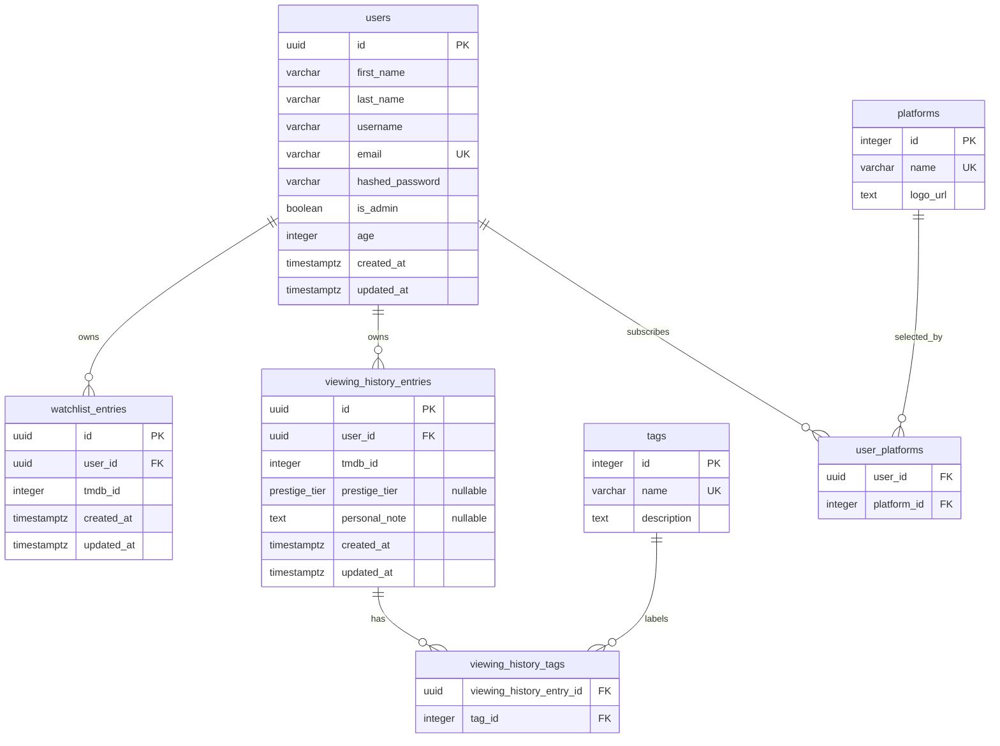

# 🎬 Film-like - Entity Relationship Diagram

This document describes the relational database structure used by Film-like.

The database is designed for **PostgreSQL** and stores only the application's persistent data: `users`, `watchlist entries`, `viewing history entries`, `tags`, `platforms`, and relationship tables.

Film metadata is not stored locally because Film-like uses the **TMDB API** as the source of truth.
Only the `tmdb_id` is stored in the database when a user saves or watches a film.

---

## Table of Contents

- [1. ER Diagram](#er-diagram)
    - [1.1. Glossary](#glossary)
    - [1.2. Relationship Summary](#relationship-summary)
- [2. Design Notes](#design-notes)
    - [2.1. Prestige Tier Values](#prestige-tier-values)
- [3. Author](#author)

---

## ER Diagram

### Glossary

| Term | Meaning |
|---|---|
| `PK` | **Primary Key** - unique identifier of a table row |
| `FK` | **Foreign Key** - column referencing the primary key of another table |
| `UK` | **Unique Key** - ensures that a value cannot appear twice in the same column |
| `uuid` | **Universally Unique Identifier** - used for user-owned entities to avoid predictable IDs |
| `integer` | **Whole number** - used for simple reference tables such as tags and platforms |
| `varchar` | **Variable-length text field** - usually used for short strings |
| `text` | **Longer text field** - used when the content length may vary significantly |
| `boolean` | **True/false value** |
| `timestamptz` | **PostgreSQL timestamp with time zone** - useful for storing dates consistently across time zones |
| `enum` | **Fixed list of allowed values** - here, `prestige_tier` limits ratings to predefined values |

---

### Relationship Summary

| Relationship | Entity A | Entity B | Type | Join table |
|---|---|---|---|---|
| A user owns watchlist entries | `users` | `watchlist_entries` | One-to-many | - |
| A user owns viewing history entries | `users` | `viewing_history_entries` | One-to-many | - |
| A user subscribes to platforms | `users` | `platforms` | Many-to-many | `user_platforms` |
| A viewing history entry is labeled with tags | `viewing_history_entries` | `tags` | Many-to-many | `viewing_history_tags` |

---

## Design Notes

**Why is `username` stored as a column and not computed from `first_name + last_name`?**
`username` is stored as an independent field to support user privacy and future modification (Won't Have user story). A user may want a display name that differs from their real name, and must be able to change it without affecting authentication data. Storing it separately keeps it independent from identity fields.

**Why there is no `films` table?**
Film-like does not store film metadata locally. Film details such as title, poster, synopsis, cast, runtime, and streaming platforms are fetched from TMDB.
The database only stores the tmdb_id, which is enough to retrieve the full film information when needed.
This avoids duplicating external data and keeps the local database simpler.

**Why `User`, `WatchlistEntry`, and `ViewingHistoryEntry` use UUIDs?**
These entities are linked to user data. UUIDs are less predictable than sequential integers, which is safer for user-owned resources.

**Why Tag and Platform use integer IDs?**
Tags and platforms are fixed reference data managed by the application. They are not sensitive user-owned resources, so integer IDs are simple and efficient.

**Why join tables are needed?**
`user_platforms` is required because one user can subscribe to many platforms, and one platform can be linked to many users.
`viewing_history_tags` is required because one viewing history entry can have many tags, and one tag can be used by many entries.

**Why created_at is used as the watch date?**
A `ViewingHistoryEntry` is created when the user marks a film as watched. Therefore, its `created_at` field can represent the watch date without adding a separate `watched_at` column.

**Why `mark_as_watched()` is a transactional operation across two tables?**
When a user marks a watchlisted film as watched, the application creates a new row in `viewing_history_entries` and immediately deletes the corresponding row in `watchlist_entries` - both in a single database transaction.
If either operation fails, the transaction is rolled back to avoid data inconsistency (a film disappearing from the watchlist without appearing in the history, or appearing in both simultaneously).
No foreign key relationship exists between the two tables: the link is purely logical, handled at the service layer.

### Prestige Tier Values

The prestige_tier enum can contain:

| Value |	Meaning |
|---|---|
| PLATINUM |	Personal masterpiece |
| GOLD |	Excellent film |
| SILVER |	Good film |
| BRONZE |	Average but watchable |
| TRASH |	Poor film |

---

## Author

**Félix Besançon**
Holberton School Bordeaux - Bachelor CDA, Year 1
Specialisation: Fullstack Development & Machine Learning

- GitHub: [@zahin-dev](https://github.com/zahin-dev)

---
