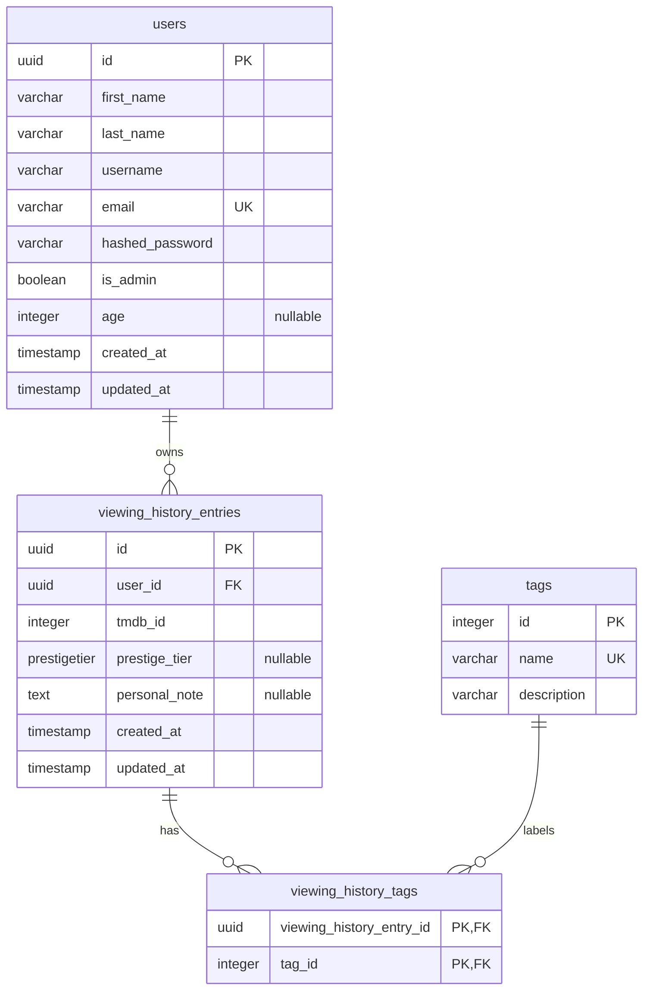

# Film-like - Entity Relationship Diagram

This diagram shows the database after the current Alembic head. TMDB remains the source of truth for every film metadata field; Film-like persists only the TMDB identifier for film identity.

## Current Database Schema

## Table Responsibilities

### `users`

Stores registration and authentication data, optional age, and reserved admin status. Email is unique. Only bcrypt password hashes are stored.

### `viewing_history_entries`

Stores the minimum film reference (`tmdb_id`) plus user-owned reaction data. The table deliberately has no `title`, `poster_url`, synopsis, genre, cast, director, runtime, provider, or foreign key to a local film entity.

`GET /films/history` retrieves title and poster data from TMDB concurrently. Display metadata can therefore change with TMDB and may be null for an individual item when enrichment fails; the database row remains intact.

### `tags`

Stores application-managed reaction tags seeded by `backend/seeds/seed_tag.py`.

### `viewing_history_tags`

Implements the many-to-many entry/tag relationship. Its composite primary key prevents the same tag association from being inserted twice for one entry.

## Migration State

The Alembic chain preserves the historical migration that added nullable title/poster cache columns. Revision `b3d91f6a2c04` follows it and drops those columns in `upgrade()`. Its `downgrade()` restores both as nullable text columns. Earlier migrations were not rewritten.

## Relationship Summary

| Relationship | Type | Storage |
|---|---|---|
| User to viewing-history entry | One-to-many | `viewing_history_entries.user_id` → `users.id` |
| Viewing-history entry to tag | Many-to-many | `viewing_history_tags` join table |

## Prestige Tier Values

`Platinum`, `Gold`, `Silver`, `Bronze`, `Coal`, and `Trash` are stored through the PostgreSQL `prestigetier` enum.

## Scope Boundaries

The current schema has no local `films`, `watchlist_entries`, `platforms`, `user_platforms`, recommendation, social, or payment tables. Mistral output is transient and is never persisted. Watchlists and platform preferences remain future roadmap ideas, not current database entities.

## Author

**zahin-dev**

- University: Kanagawa Institute of Technology
- GitHub: [@zahin-dev](https://github.com/zahin-dev)
