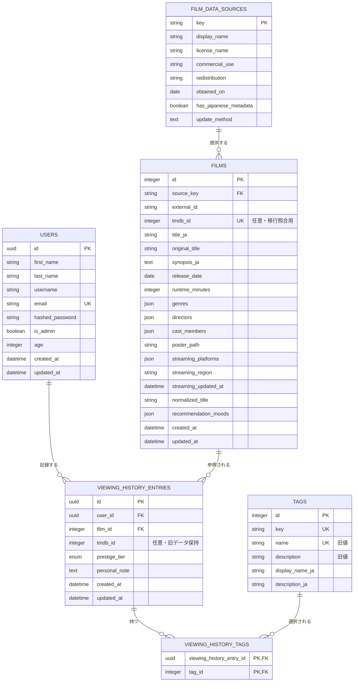

# ER図

`film_id`が現在の映画識別子です。`tmdb_id`は既存履歴の照合と将来の移行のために保持しますが、映画検索や詳細表示の必須値ではありません。

評価Enumの英語値は既存データ互換の内部値です。APIは`prestige_tier_label`で日本語表示を追加します。

## チーム帰属

このスキーマは3名で共同開発・保守するFilm-likeの現行構成です。バックエンドは`zahin-dev`、フロントエンドは`aoi-dev`、インフラは`sakamoto-dev`が主担当ですが、主担当は排他的な作者や貢献割合を意味しません。`zahin-dev`アカウントでのリポジトリ管理も単独所有を意味しません。
