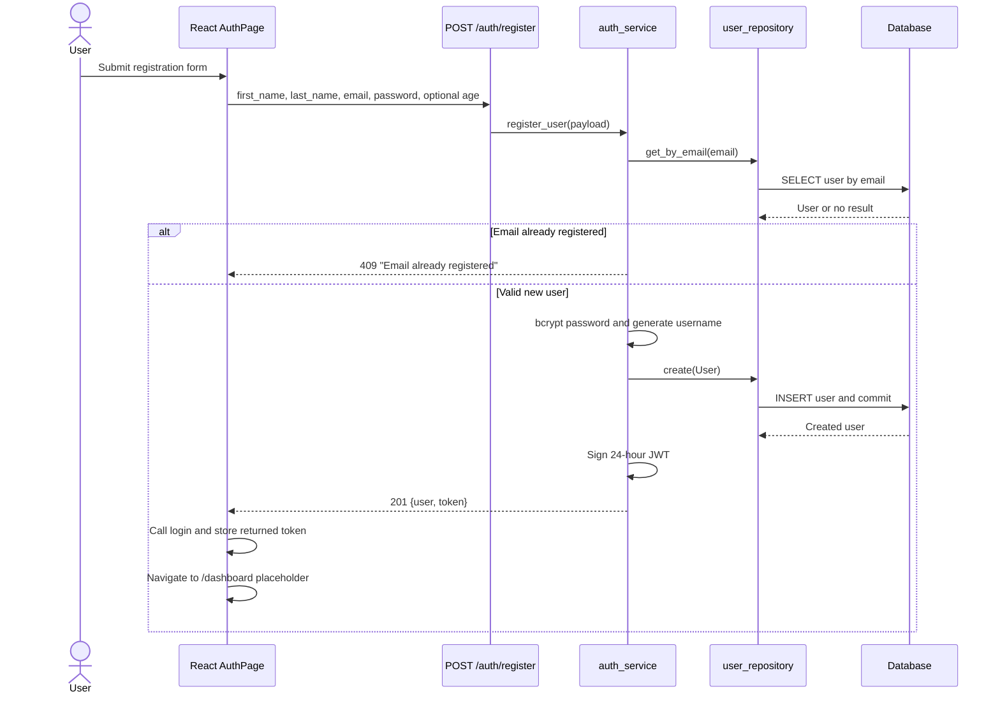
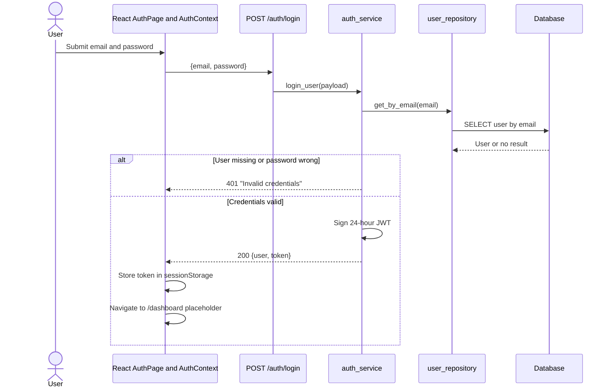
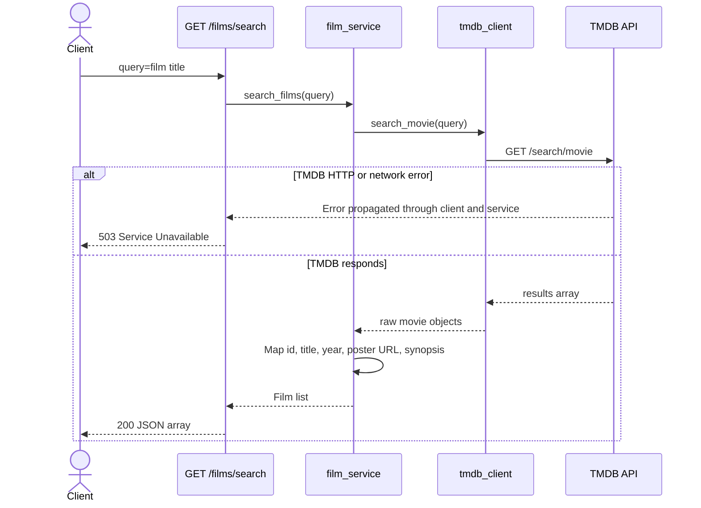
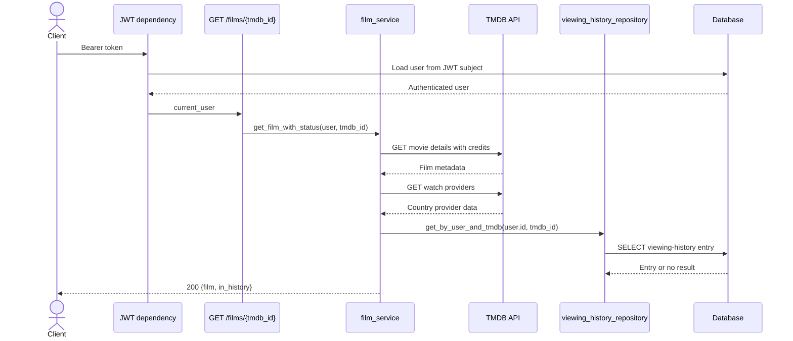
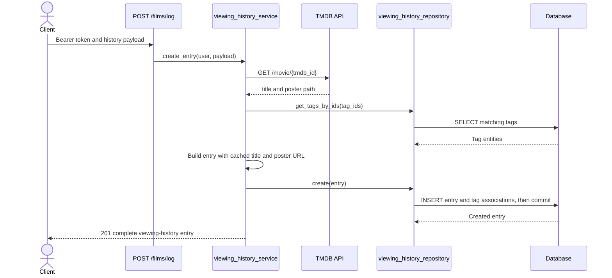
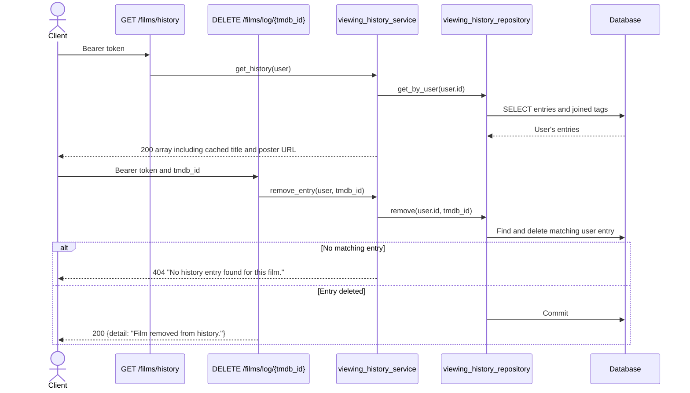
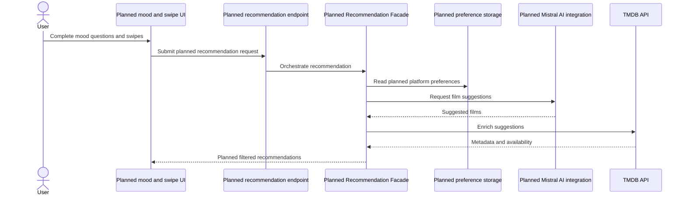

# Film-like - Sequence Diagrams

This document separates flows supported by current source modules from planned product flows. The implemented film flows below describe backend API behavior; except for authentication, the corresponding frontend pages are still placeholders.

> **Repository completeness note:** the checked-in route, service, repository, model, and test source defines these backend flows, but the imported `app.schemas` package is absent from the current Git tree. Runtime verification is therefore blocked until those schema modules are restored.

## Currently Implemented Flows

### User Registration

The authentication page implements registration. It calls `POST /auth/register`, then performs a separate login call and stores the login token in session storage before navigating to the placeholder dashboard.

Request-schema validation failures are handled by FastAPI/Pydantic as `422 Unprocessable Entity`. The service explicitly handles duplicate email addresses as `409 Conflict`.

### User Login

Both authentication failures return the same message to avoid revealing whether an email address is registered.

### TMDB Film Search

`GET /films/search?query={title}` is public. The catalog page does not yet call it.

A missing or empty query is rejected with `422 Unprocessable Entity` by FastAPI validation.

### TMDB Film Details and History Status

`GET /films/{tmdb_id}` requires a Bearer token. It retrieves complete TMDB details and subscription watch-provider names for the TMDB client's configured country, then checks only whether the film exists in the authenticated user's viewing history. It does not check a watchlist.

TMDB `404` responses become an API `404`. Other TMDB HTTP failures and network failures become `503 Service Unavailable`.

### Tags and Viewing-History Creation

`GET /tags` is public. `POST /films/log` requires a Bearer token and accepts `tmdb_id`, optional `tag_ids`, optional `prestige_tier`, and optional `personal_note`.

The persisted entry contains `tmdb_id`, cached `title`, cached `poster_url`, tags, prestige tier, and personal note. TMDB remains the source of truth for complete metadata.

### Viewing-History Retrieval and Deletion

Both operations require a Bearer token. Deletion uses a TMDB identifier, not a viewing-history entry UUID.

## Planned Flows - Not Current Implementation

The following diagram is a proposed future flow. It is not a current working sequence: there are no recommendation routes, Recommendation Facade, Mistral client, platform-preference persistence, watchlist operations, mood questionnaire, or swipe implementation in the current source.

Watchlist and user-profile operations are also planned. No `/films/watchlist`, `/users/me`, `/users/me/platforms`, or `/recommendations/start` route is registered by the current FastAPI application.

## Author

**zahin-dev**

- University: Kanagawa Institute of Technology
- GitHub: [@zahin-dev](https://github.com/zahin-dev)
