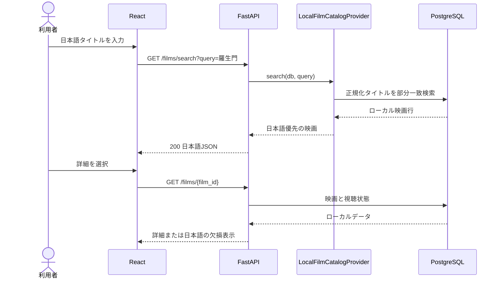
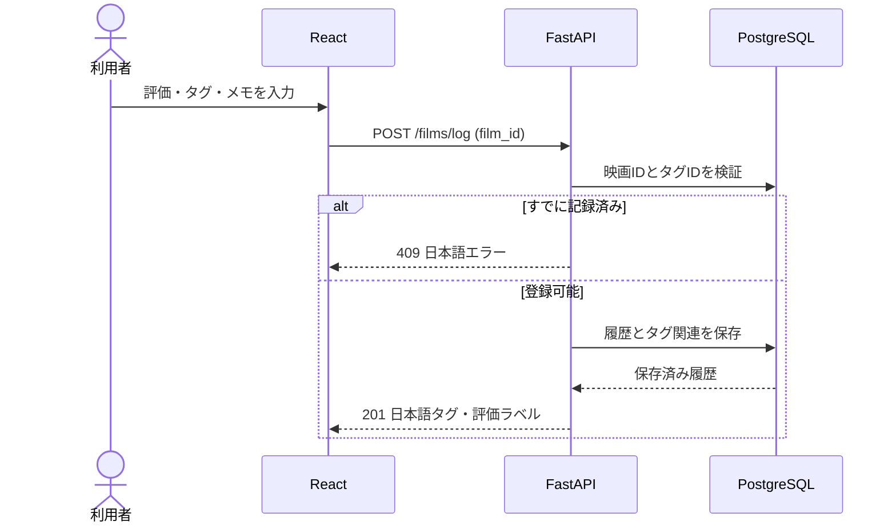
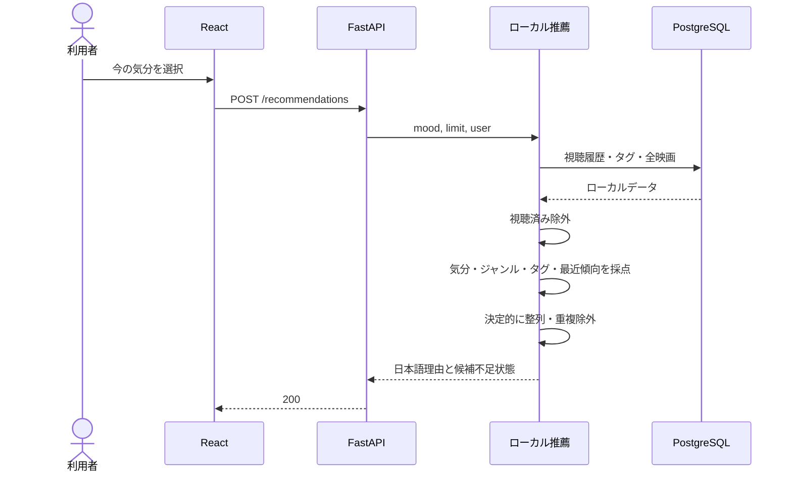
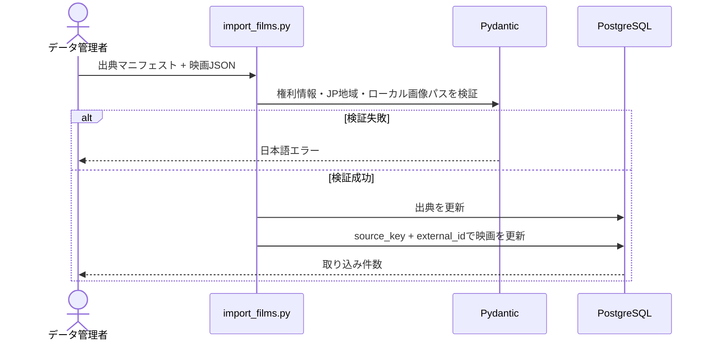

# 主要シーケンス

## 映画検索と詳細

外部映画APIや翻訳APIへの呼び出しはありません。

## 視聴記録

旧クライアントが`tmdb_id`を送った場合は、ローカルカタログで照合して同じ`film_id`へ保存します。

## ローカル推薦

クラウドLLM、乱数、外部照合は使いません。

## データインポート

## チームと主担当

Film-likeは3名で共同開発・保守しています。Reactフローは`aoi-dev`、FastAPIとローカル業務ロジックは`zahin-dev`、DockerとCIは`sakamoto-dev`が主担当です。主担当は単独作者を意味せず、3名がレビュー、デバッグ、テスト、設計、文書化を横断的に行います。`zahin-dev`アカウントは管理上のホスト兼公開連絡先であり、単独所有を意味しません。
