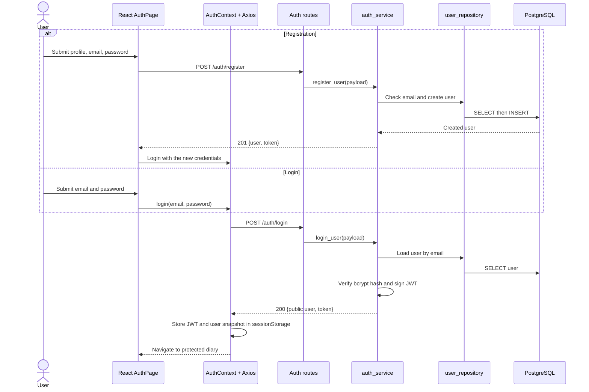
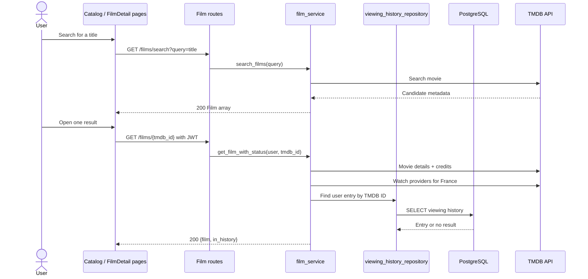
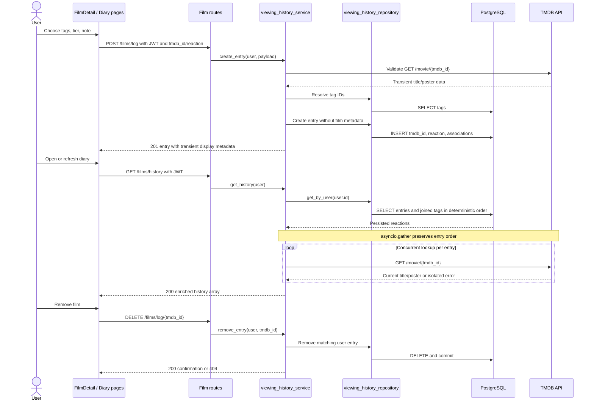

# Film-like - Sequence Diagrams

These flows are implemented by the current FastAPI and React source. External calls are real in live use and fully mocked in the automated backend suite.

## Authentication and Protected Navigation



Pydantic validation returns `422`, duplicate registration returns `409`, and invalid credentials return a non-enumerating `401` response. Protected React routes redirect unauthenticated users to the authentication page. The centralized Axios client attaches the Bearer token and clears rejected sessions.

## Catalog Search and Film Detail



The frontend displays loading, error, and no-result states. TMDB `404` becomes an API `404`; other TMDB/network failures are controlled `503` responses.

## Log, Retrieve, and Remove Viewing History



TMDB data returned during logging is never assigned to mapped columns. A failed retrieval enrichment produces null title/poster values for that item and never deletes or mutates the record.

## Mood-Based Recommendation Facade

```mermaid
sequenceDiagram
    actor User
    participant UI as RecommendationPage
    participant Route as POST /recommendations
    participant Facade as Recommendation Facade
    participant Repo as viewing_history_repository
    participant DB as PostgreSQL
    participant MistralClient as mistral_client
    participant Mistral as Mistral API
    participant TMDB as TMDB API

    User->>UI: Select one supported mood
    UI->>Route: {mood, limit} with JWT
    Route->>Facade: recommend(user, mood, limit)
    Facade->>Repo: Read viewing history and tags
    Repo->>DB: SELECT entries and associations
    DB-->>Facade: User-owned reactions and TMDB IDs
    Facade->>Facade: Count tag frequencies
    Facade->>TMDB: Resolve recent viewed titles concurrently
    Facade->>Facade: Build controlled mood/history context
    Facade->>MistralClient: Messages + strict Pydantic JSON Schema
    MistralClient->>Mistral: POST /v1/chat/completions
    Mistral-->>Facade: Structured title/year/reason candidates
    Facade->>Facade: Strict parse, year checks, title deduplication

    loop Candidate verification
        Facade->>TMDB: Search candidate title
        TMDB-->>Facade: TMDB Film matches
        Facade->>Facade: Prefer year; exclude watched/duplicate IDs
    end

    alt Enough verified results
        Facade-->>Route: Mood, tags used, verified films and reasons
        Route-->>UI: 200 RecommendationResponse
        UI->>UI: Display next/skip recommendation deck
    else Structured/resolution shortfall on first attempt
        Facade->>MistralClient: Retry once with different-candidate instruction
    else Missing key or controlled upstream/output error
        Facade-->>UI: 503, 504, or 502 safe error
    end
```

The model never supplies a trusted TMDB ID. Only TMDB-resolved `Film` objects are returned. The API key, authorization header, raw prompt, and raw upstream response are not included in HTTP error details. The application starts without a Mistral key, but this endpoint then returns `503` rather than fake results.

## Future Flows - Not Implemented

Watchlists, profile editing, stored platform subscriptions, social/shared lists, payment flows, and platform-based recommendation filtering have no current routes or persistence. `/films/watchlist`, `/users/me`, `/users/me/platforms`, and `/recommendations/start` are not registered endpoints.

## Author

**zahin-dev**

- University: Kanagawa Institute of Technology
- GitHub: [@zahin-dev](https://github.com/zahin-dev)
