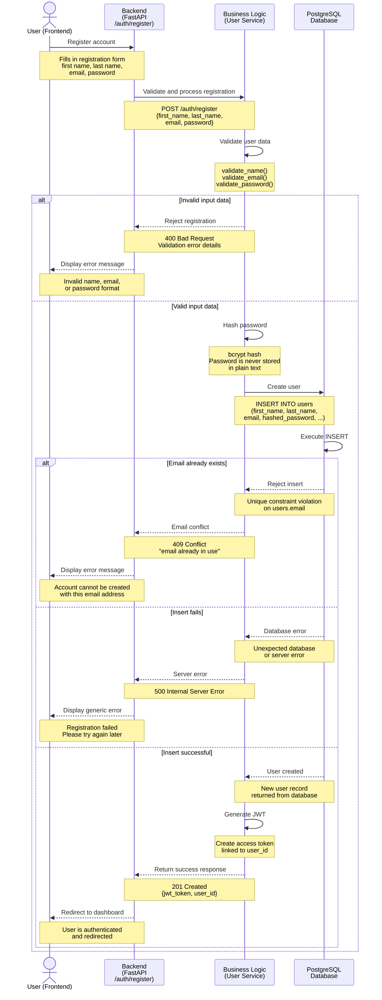
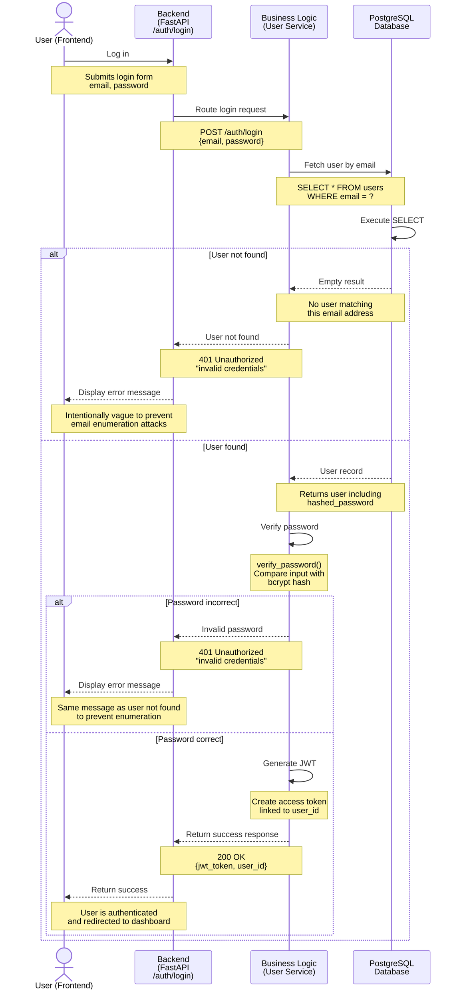
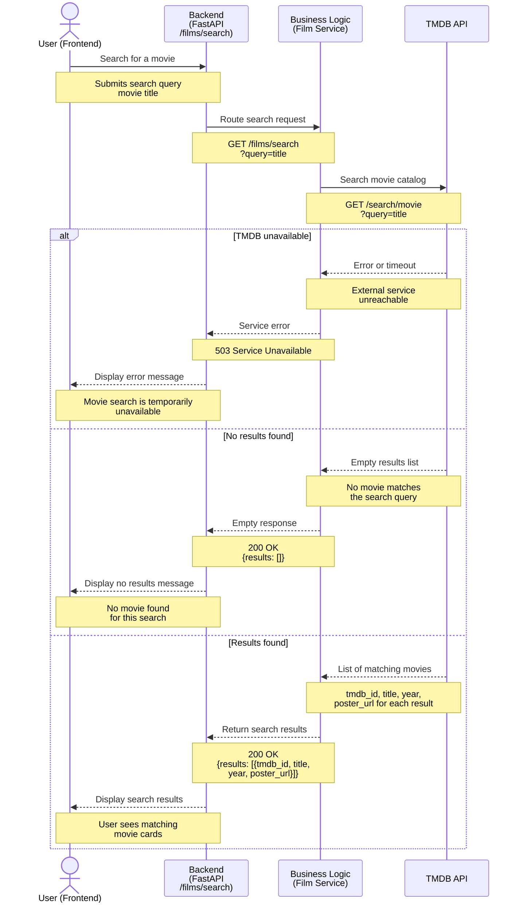
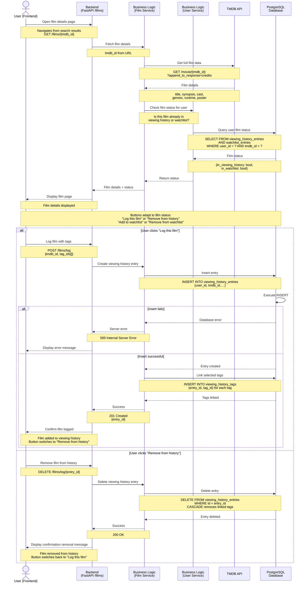
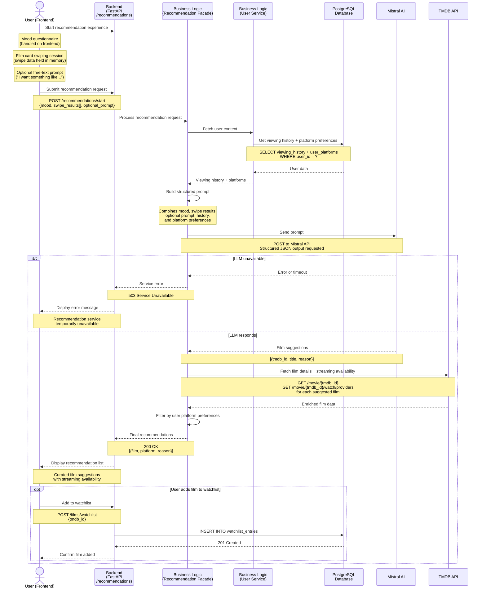

# 🎬 Film-like - High-Level Sequence Diagrams

This document illustrates the key interaction flows of the Film-like application.
Each diagram shows how the system components communicate step by step for a given use case.

---

## Table of Contents

- [1. User Registration](#user-registration)
- [2. User Login](#user-login)
- [3. Searching for a Movie](#searching-for-a-movie)
- [4. Log a Film](#log-a-film)
- [5. Film Recommendation](#film-recommendation)
- [6. Author](#author)

---

## User Registration

This sequence covers the full flow when a new user creates an account on Film-like.

**Actors:**

- `User` - user interacting through the React frontend
- `Backend` - the `/auth/register` route of the `FastAPI`
- `Business Logic` - the  User Service of the `FastAPI`
- `Database` - the PostgreSQL database

**Key steps:**

1. The user submits the registration form via the frontend
2. The frontend sends a POST request to /auth/register
3. The backend routes the request to the User Service
4. The User Service validates the input data (name, email, password format)
5. The User Service hashes the password using bcrypt
6. The User Service inserts the new user record into the database
7. If the email already exists, a 409 Conflict is returned
8. If the insert fails, a 500 Internal Server Error is returned
9. If successful, a JWT token is generated and returned with a 201 Created response
10. The frontend redirects the authenticated user to the dashboard

---

## User Login

This sequence covers the flow when a returning user logs into their account.

**Actors:**

- `User` - user interacting through the React frontend
- `Backend` - the `/auth/login` route of the `FastAPI`
- `Business Logic` - the User Service of the `FastAPI`
- `Database` - the PostgreSQL database

**Key steps:**

1. The user submits their email and password via the frontend
2. The frontend sends a POST request to /auth/login
3. The backend routes the request to the User Service
4. The User Service queries the database for the user by email
5. If the user is not found, a 401 Unauthorized is returned
6. The User Service verifies the password against the stored bcrypt hash
7. If the password is incorrect, a 401 Unauthorized is returned
8. If valid, a JWT token is generated and returned with a 200 OK response
9. The frontend stores the token and redirects to the dashboard

> ***Security note**: why both error cases return the same message? 
> When a login attempt fails, the API always returns the same error message: `"invalid credentials"` - whether the email does not exist or the password is incorrect.
> This is a deliberate security practice known as **credential enumeration prevention**. 
> If the API returned different messages ("email not found" vs "wrong password"), an attacker could systematically test email addresses to discover which ones are registered in the system. 
> By returning the same message in both cases, the system reveals no information about which part of the credentials was wrong.*

---

## Searching for a Movie

This sequence covers the flow when a user searches for a movie in the TMDB catalog, in order to log it or add it to their watchlist.

**Actors:**

- `User` - user interacting through the React frontend
- `Backend` - the `/films/search` route of the `FastAPI`
- `Business Logic` - the Film Service of the `FastAPI`
- `API` - the TMDB API

**Key steps:**

0. The user navigates through the app to the movie search page
1. The user types a movie title in the search bar and confirms
2. The frontend sends a GET request to `/films/search?query=...`
3. The backend routes the request to the Film Service
4. The Film Service calls the TMDB search endpoint
5. TMDB returns a list of matching films (multilingual search by default)
6. The backend returns the results to the frontend
7. The user selects a film from the results

> ***Note on multilingual search**: 
> The TMDB /search/movie endpoint supports multilingual queries by default.
> A search for "Les Évadés" will return "The Shawshank Redemption", and vice versa, regardless of the language parameter set for the response. 
> The language parameter only affects the language of the returned data (titles, synopses, genres), not the search matching itself. 
> For the MVP, all responses are returned in English (language=en-US).**

---

## Log a Film

This sequence covers the flow when a user views a film's details page and logs it to their viewing history.

**Actors:**

- `User` - user interacting through the React frontend
- `Backend` - the `/films/*` routes of the `FastAPI`
- `Business Logic - Film Service` - the Film Service of the `FastAPI`
- `Business Logic - User Service` - the User Service of the `FastAPI`
- `API` - the TMDB API
- `Database` - the PostgreSQL database

**Key steps:**

0. The user navigates through the app to a film's details page (from search results)
1. The backend fetches full film details from TMDB
2. The backend checks if the film is already in the user's viewing history or watchlist
3. The frontend displays the film details and adapts the action buttons accordingly
4. The user clicks "Log this film" and selects tags
5. The backend creates a viewing history entry and links the selected tags
6. A `201 Created` response confirms the film has been logged

> ***Note on film status check**: 
> When a user opens a film details page, the backend automatically checks whether that film is already present in the user's viewing history and watchlist. 
> This check runs before the page is displayed, so the action buttons always reflect the current state: "Log this film" or "Remove from history", "Add to watchlist" or "Remove from watchlist". 
> On the frontend side, no page reload is required after an action - React updates the button state immediately using local component state, providing an instant and seamless experience.*

---

## Film Recommendation

This sequence covers the full recommendation flow, from the mood questionnaire to the final film suggestions.

**Actors:**

- `User` - user interacting through the React frontend
- `Backend` - the `/recommendation/*` routes of the `FastAPI`
- `Business Logic - Recommendation Facade` - the Recommendation Facade of the `FastAPI`
- `Business Logic - User Service` - the User Service of the `FastAPI`
- `API` - the TMDB API
- `LLM` - the Mistral AI API
- `Database` - the PostgreSQL database

**Key steps:**

0. The user navigates from the home screen to the Recommendation experience
1. The user starts the recommendation experience
2. The user completes a mood questionnaire (handled entirely on the frontend)
3. The user swipes through film cards (right = interested, left = not interested)
4. The user optionally adds a free-text prompt before final submission
5. The backend retrieves the user's viewing history and platform preferences
6. The backend sends a structured prompt to the LLM
7. The LLM returns film suggestions
8. The backend enriches the suggestions with TMDB data and streaming availability
9. The frontend displays the final recommendation list

> ***Note on the recommendation flow**
> The mood questionnaire and swipe session are handled entirely on the frontend and held in memory - no intermediate data is sent to the backend until the user submits the final request. 
> This keeps the backend stateless and reduces unnecessary API calls. 
> The optional free-text prompt allows the user to add a personal touch to the recommendation request before it is sent to the LLM.*

---

## Author

**Félix Besançon**
Holberton School Bordeaux - Bachelor CDA, Year 1
Specialisation: Fullstack Development & Machine Learning

- GitHub: [@zahin-dev](https://github.com/zahin-dev)

---
